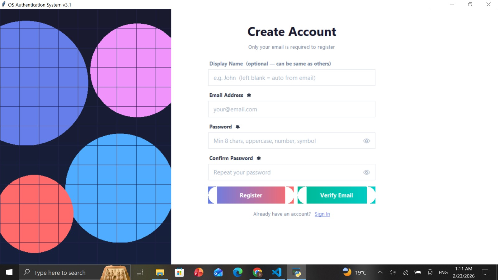
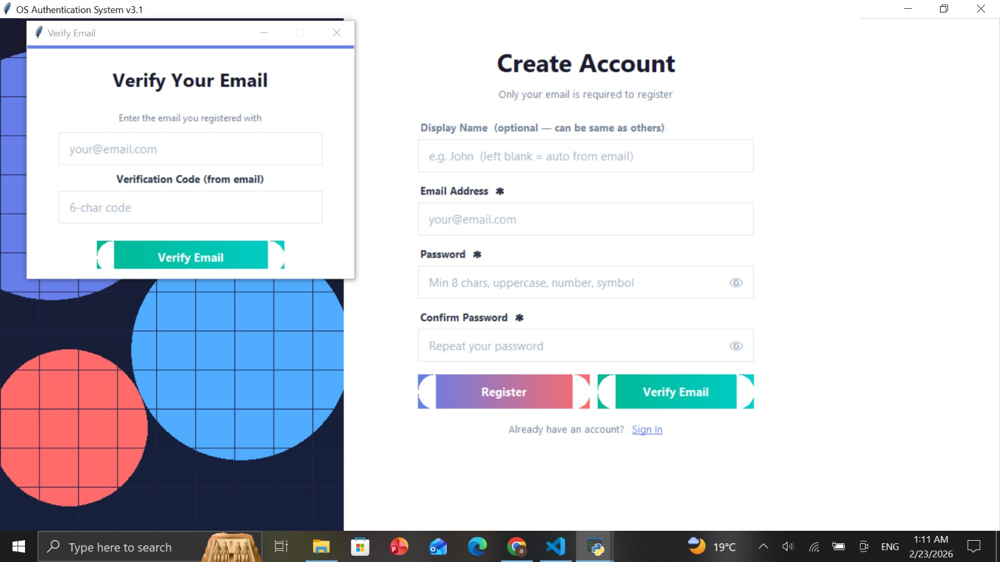
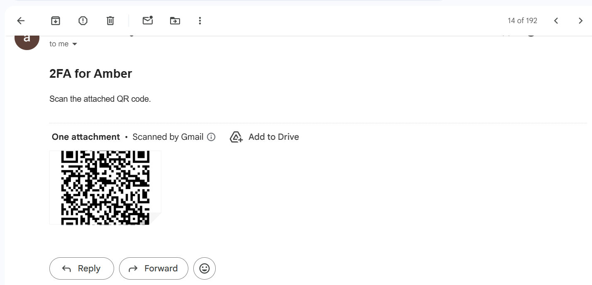
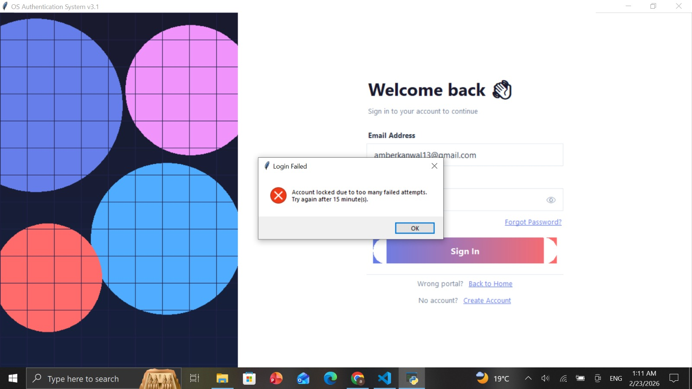
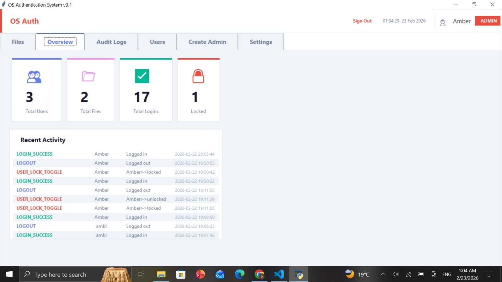
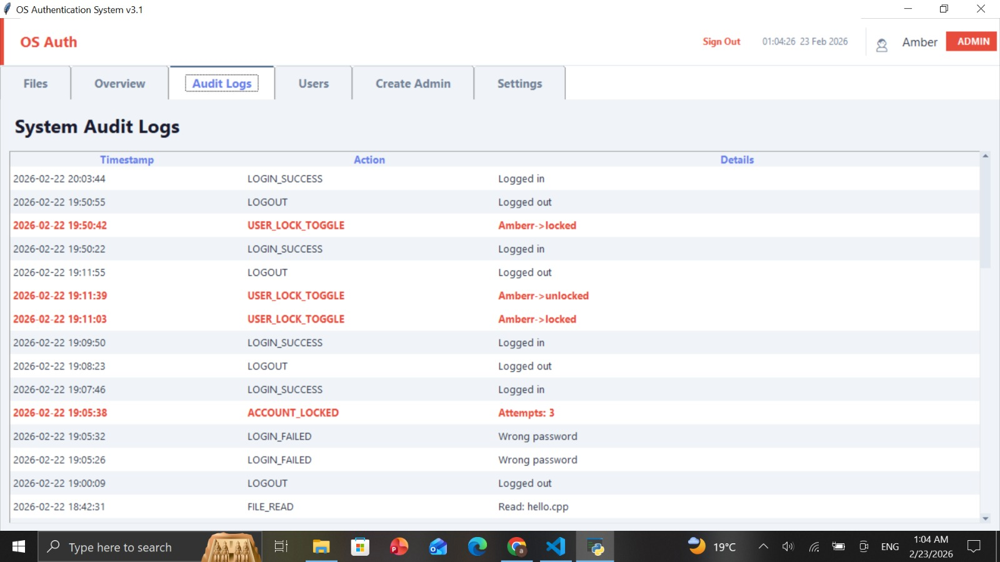
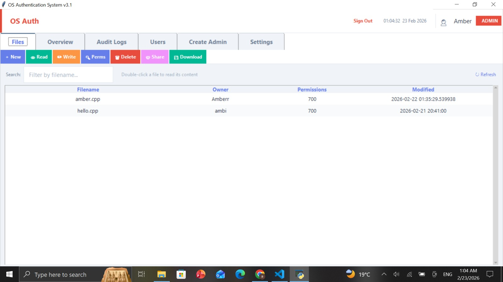
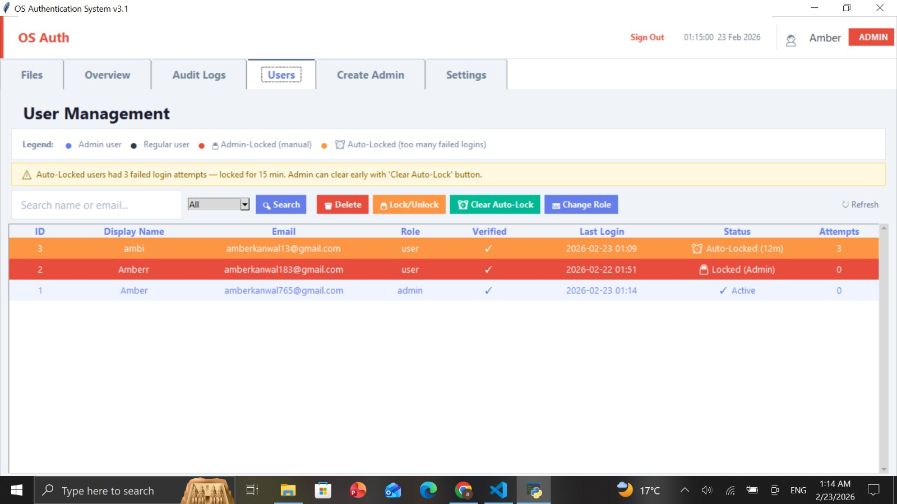
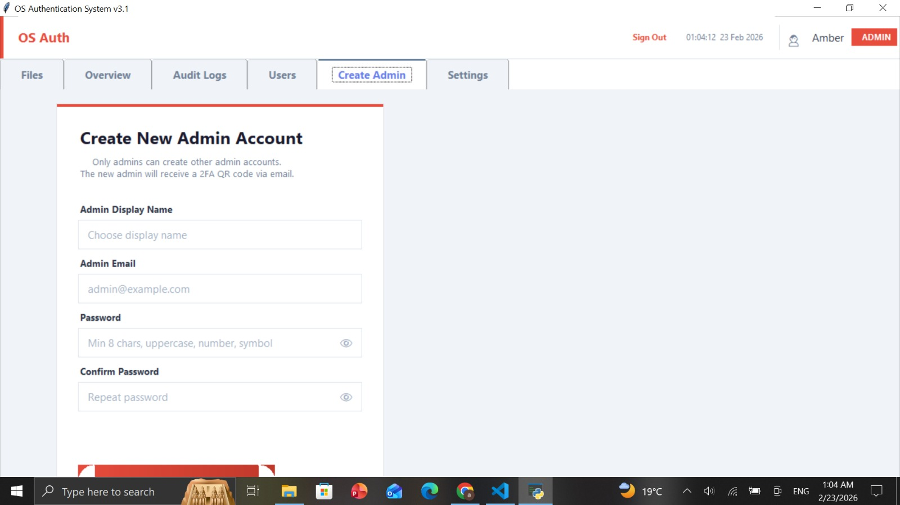

<div align="center">


# 🔐 OS Authentication System v3.1
### A Production-Level Secure Login & File Permission Desktop Application


**Built by [Amber Kanwal](https://linkedin.com/in/amber-kanwal-088b22350) — OS Subject Project | Contact me for project amberkanwal183@gmail.com**

</div>

---

## 🚀 About The Project

**OS Authentication System v3.1** is a fully functional **desktop security application** built with **Python and Tkinter** that brings Operating System concepts to life. It implements real-world OS principles including **role-based access control (RBAC)**, **Unix-style file permissions**, **session management**, **brute-force protection**, and **complete audit logging** — all within a polished, professional GUI.

> 💡 This project was developed as part of the **Operating Systems** course to demonstrate how theoretical OS security concepts translate into real working systems.

---

## ✨ Features

### 🏠 Dual Portal System
- **User Portal** — Access personal files and account settings
- **Admin Portal** — Full system control with elevated privileges
- Clean portal selection screen on startup

### 📝 Secure Registration & Email Verification
- Sign up with display name, email, and strong password
- Password enforcement: min 8 chars, uppercase, number, symbol
- **6-character email verification code** sent on registration
- Email must be verified before account activation

### 🔑 Two-Factor Authentication (2FA)
- **Google Authenticator TOTP** integration
- New admin accounts automatically receive **QR code via email**
- 2FA secret viewable/hideable from Settings
- 3 attempts allowed before lockout

### 🔒 Brute-Force Protection
- Account **auto-locked after 3 failed login attempts**
- Lock duration: **15 minutes**
- Admin can **manually lock/unlock** any user
- Visual distinction: Auto-Locked 🟠 vs Admin-Locked 🔴

### 🔑 Forgot Password Flow
- Email-based secure password reset
- Reset code sent directly to registered email

### 📁 File System with Unix Permissions
- Files stored with **owner + permission code** (e.g. 700)
- **Read / Write / Delete / Share / Download** operations
- **"Permission Denied"** enforced when unauthorized user accesses a file
- Filter files by name, view modification timestamps

### 📊 Admin Dashboard
- **Live stats:** Total Users, Files, Logins, Locked accounts
- **Recent Activity** feed with color-coded event types

### 📋 System Audit Logs
- Complete timestamped trail of all events
- Events tracked: `LOGIN_SUCCESS` `LOGIN_FAILED` `LOGOUT`
  `ACCOUNT_LOCKED` `USER_LOCK_TOGGLE` `FILE_READ`
- Color-coded log entries (red = security events)

### 👥 User Management
- View all users with ID, email, role, verified status, last login
- Actions: **Lock/Unlock**, **Delete**, **Change Role**, **Clear Auto-Lock**
- Search users by name or email, filter by role

### ⚙️ Settings Panel
- Update display name and email address
- Change password (current password required)
- View/hide 2FA secret key
- Session timeout: **30 minutes inactivity**
- Max login attempts: **Auto-locked after 3 fails**

### 🛡️ Create Admin
- Only existing admins can create new admin accounts
- New admin receives **2FA QR code via email** automatically

---

## 🛠️ Tech Stack

| Layer | Technology |
|-------|-----------|
| Language | Python 3 |
| GUI Framework | Tkinter |
| Database | SQLite3 |
| Authentication | TOTP / Google Authenticator |
| Email Service | Gmail SMTP |
| 2FA Standard | RFC 6238 TOTP |
| Platform | Windows 10/11 |

---

## 📦 Requirements
```bash
pip install pyotp pillow qrcode smtplib
```

---

## ▶️ How to Run
```bash
# Clone the repo
git clone https://github.com/amberkanwal12/OS-Authentication-System.git

# Go into the folder
cd OS-Authentication-System

# Install dependencies
pip install -r requirements.txt

# Run the app
python main.py
```

---

## 🧠 OS Concepts Applied

| Concept | Implementation |
|---------|---------------|
| **File Permissions** | Unix-style rwx / 700 permission model |
| **Role-Based Access Control** | Admin vs User privilege separation |
| **Session Management** | 30-min inactivity timeout |
| **Audit Logging** | System call-style event tracing |
| **Rate Limiting** | Brute-force lockout after 3 attempts |
| **Authentication Factors** | Password + TOTP (2FA) |

---

## 📸 Screenshots

<table>
  <tr>
    <td align="center"><b>Portal Selection</b></td>
    <td align="center"><b>Create Account</b></td>
  </tr>
  <tr>
    <td></td>
    <td></td>
  </tr>
  <tr>
    <td align="center"><b>Email Verification</b></td>
    <td align="center"><b>2FA — Verify Identity</b></td>
  </tr>
  <tr>
    <td></td>
    <td></td>
  </tr>
  <tr>
    <td align="center"><b>Account Lockout</b></td>
    <td align="center"><b>Forgot Password</b></td>
  </tr>
  <tr>
    <td></td>
    <td></td>
  </tr>
  <tr>
    <td align="center"><b>Admin Dashboard</b></td>
    <td align="center"><b>System Audit Logs</b></td>
  </tr>
  <tr>
    <td></td>
    <td></td>
  </tr>
  <tr>
    <td align="center"><b>File Manager</b></td>
    <td align="center"><b>User Management</b></td>
  </tr>
  <tr>
    <td></td>
    <td></td>
  </tr>
  <tr>
    <td align="center"><b>Profile & 2FA Settings</b></td>
    <td align="center"><b>Create Admin</b></td>
  </tr>
  <tr>
    <td></td>
    <td></td>
  </tr>
</table>

---

## 🔄 System Flow
```
User Opens App
      │
      ▼
 Choose Portal
 ┌────┴────┐
 │         │
User     Admin
 │         │
Sign In  Sign In
 │         │
 └────┬────┘
      │
   Password ✓
      │
   2FA TOTP ✓ (Admin only)
      │
   Dashboard
  ┌───┴────────────┐
Files  Users  Audit  Settings
```

---

## 👩‍💻 Developer

**Amber Kanwal**
BS Software Engineering — 5th Semester
Riphah International University, Sahiwal, Pakistan
CGPA: 3.91 / 4.00 *(Highest in Department)*

[](https://linkedin.com/in/amber-kanwal-088b22350)
[](https://github.com/amberkanwal12)
[](https://ambar.nebulaxent.com)

---

<div align="center">
⭐ Star this repository if you found it helpful!
</div>
